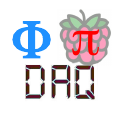
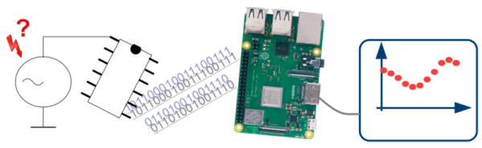
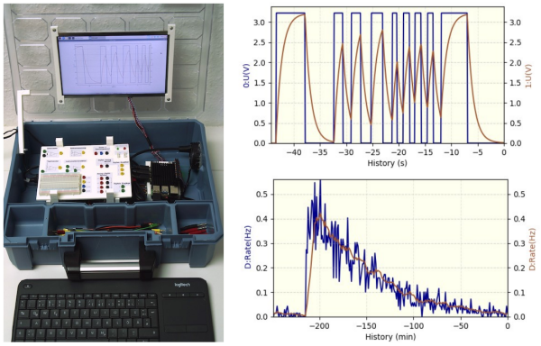

<!--
This is the source for https://phypidaq.github.io/index.html,
generated via   pandoc README.md -o index.html
-->

<body style="background-color:white;">

     &nbsp;         

 

<h1 ALIGN="center"; style="background-color:GhostWhite"> 
 Data Acquisition for Physics Experiments  
     with Raspberry Pi 
 &nbsp;
</h1>

 

 
  

 

<h3 ALIGN="center"; style="background-color: AliceBlue;"> 
&nbsp;  
Acquisition, visualization and analysis of data 
for educational physics experiments  
  &nbsp;
</h3>

 

## Project Executive Summary

The *PhyPiDAQ* project aims to provide students access to state-of-the-art measurement 
technology and data acquisition tools. As it is based on standardized protocols and hardware, 
it can not only be cheaper to set up than similar offers, but also gives a great educational 
introduction in methods of modern science. 
Additionally, the measuring technology can be run off a power bank, making it portable and
allowing great experiments in nature. 
This project targets students from middle school up to undergraduates at the university level
with great matching educational concepts. Looking beyond school it is also a good base for STEM 
based competitions or science fairs.

The figure above shows on the left the measuring case with Raspberry Pi, the front 
face of  the circuit board with 2&nbsp;mm connectors, the TFT display and the keyboard. 
On the top right is shown the voltage over a capacitor driven by a sqare wave, measured 
with an ADS 1115 analog-to-digital converter. 
On the bottom right you see  the gamma-ray rate from Radon decay products measured 
with a GDK 101 sensor. Note that the experiments can also be performed without the
mearuring case by assembling the components on separate bread boards connected to
the Rasprerry Pi. 

Detailed descriptions of the software, hardware guides and build instructions or
of educational concepts are available in the 
[repositories of the *PhyPiDAQ* project](https://github.com/PhyPiDAQ). 
The older version Raspbian "stretch" of the Raspberry Pi operating system ist
supported by the [legacy version](https://github.com/GuenterQuast/PhyPiDAQ).

#### Installation

The necessary steps to install PhyPiDAQ on a Raspberry Pi are documented in this 
[shell script](install_phypidaq.sh). See full documentation for details.

#### Currently available Documentation

 - [Software Description](
   https://github.com/PhyPiDAQ/PhyPiDAQ/blob/main/docs/Documentation_en.md)
 - [Educators Guide](https://github.com/PhyPiDAQ/EducatorsGuide/blob/main/EducatorsGuide.md)
 - [Hardware build instructions](https://github.com/PhyPiDAQ/MeasuringCase/blob/main/Documentation_en.md)

## Übersicht in deutscher Sprache

Das PhyPiDAQ-Projekt zielt darauf ab, Studierenden und SchülerInnen Zugang zu moderner 
Messtechnik und Datenerfassung zu verschaffen. Da es auf offenen, standardisierten 
Protokollen und leicht verfügbarer Hardware basiert, kann es nicht nur kostengünstig 
eingerichtet werden, sondern bietet auch eine hervorragende pädagogische Möglichkeiten 
zur Einführung in die Messmethoden der modernen Wissenschaft.
Die Messtechnik kann mit einer Powerbank betrieben werden, was sie tragbar macht
und Experimente auch in freier Natur ermöglicht. 
*PhyPiDAQ* richtet sich an SchülerInnen von der Mittelstufe bis hin zu
Studierenden auf Universitätsebene. 
Über die Schule hinaus ist es auch eine gute Basis für MINT-Wettbewerbe.

Die Abbildung oben zeigt links den Messkoffer mit Raspberry Pi, der Vorderseite der 
Platine mit 2-mm-Steckern, TFT-Display und Tastatur. Rechts oben ist der Spannungsverlauf 
an einem Kondensator bei Anlegen eines Rechtecksignals mit unregelmäßiger Frequenz 
gezeigt, gemessen mit einem ADS 1115 Analog-Digital-Wandler. Rechts unten sieht man 
die Gammastrahlungsrate von Radon-Zerfallsprodukten, gemessen mit einem GDK 101-Sensor. 
Die einzelnen Experimente des PhyPiDAQ-Projekts können auch ohne den Koffer auf an den 
Raspberry Pi angeschlossenen Breadbords aufgebaut werden. 

Detaillierte Beschreibungen der empfohlenen Hardware, der Software sowie Bauanleitungen 
und Beschreibungen von Experimenten mit PhyPiDAQ finden Sie in den 
[Repositories des *PhyPiDAQ*-Projekts](https://github.com/PhyPiDAQ). 
Die ältere Version Raspbian "stretch" des Raspberry Pi Betriebssystems wird von 
der [PhiPyDAQ legacy version](https://github.com/GuenterQuast/PhyPiDAQ) unterstützt.

#### Installation

Die zur Installation von PhyPiDAQ auf einem Raspberry Pi notwendigen Schritte
befinden sich in diesem [Shell Script](install_phypidaq.sh). Weitere Details 
sind in der vollen Dokumentation zu finden. 

#### Derzeit verfügbare Dokumentation

 - [Anleitung für Lehrkräfte](https://github.com/PhyPiDAQ/EducatorsGuide/blob/main/Anleitung.md)
 - [Einführungskurs für Schülerinnen und Schüler](
     https://github.com/PhyPiDAQ/EducatorsGuide/blob/main/docs/Kurs_digitale_Messwerterfassung_mit_PhyPiDAQ.pdf)
 - [Beschreibung der Software](https://github.com/PhyPiDAQ/PhyPiDAQ/blob/main/docs/Dokumentation_de.md)
 - [Bauanleitung Messkoffer](https://github.com/PhyPiDAQ/MeasuringCase/blob/main/Dokumentation_de.md)

## Contributing

For information on how to contribute to this project, please refer to the 
[CONTRIBUTING.md](CONTRIBUTING.md) file.

## License

This project is licensed under the `MIT BSD 2-Clause License`. For more information refer to the 
[LICENSE](LICENSE) file.
